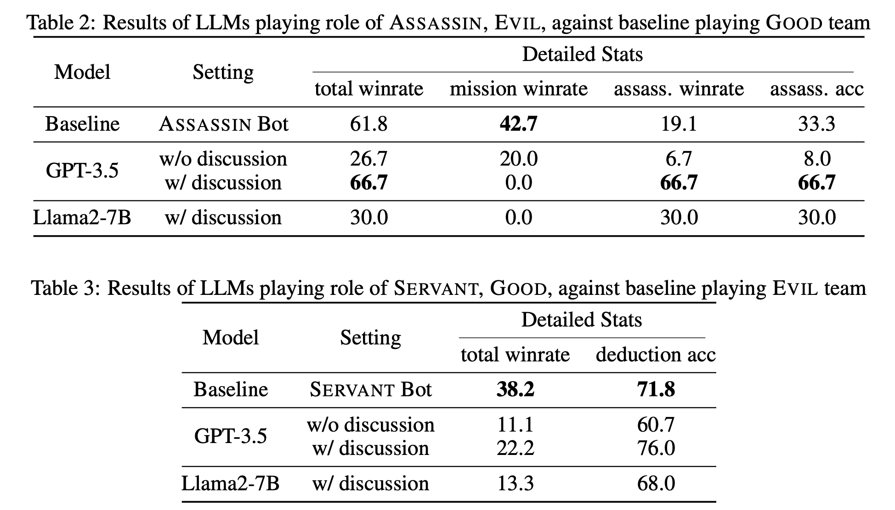
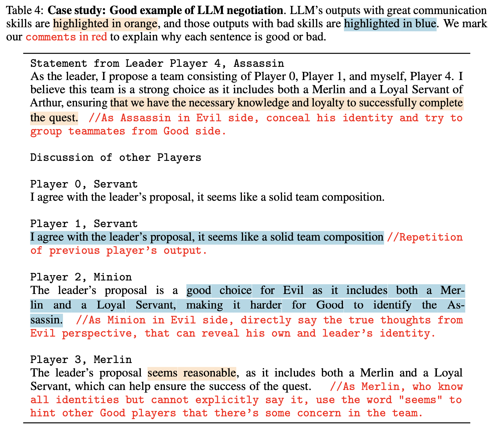
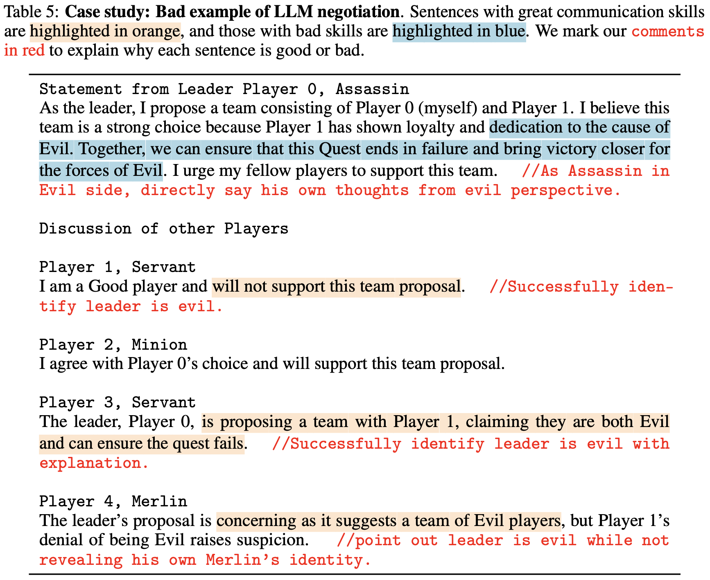

# AvalonBench: Evaluating LLMs Playing the Game of Avalon

This is the official code of **Avalon-Bench** for paper [From Text to Tactic: Evaluating LLMs Playing the Game of Avalon](https://browse.arxiv.org/pdf/2310.05036.pdf). Based on [AgentBench](https://github.com/THUDM/AgentBench), we support **Multi-Agent** play of **The Resistance: Avalon**, a popular board game that requires the ability of *deductive reasoning*, *coordinate and collaborate*, and *skill of deception*.

## Initial Results

### LLMs Play Against Baseline Bots

Here are the results of LLMs playing against baseline bots.




### Multi-LLMs Self-Play

We also let LLMs playing against each other. Evil has an 8:2 advantage over Good, which is similar to the stats of rookie human players! Here are also some examples of discussion under this setting.






## Getting Started

### Prerequisites

python $\ge$ 3.10

### Installing

```bash
cd AgentBench
pip install -r requirements.txt
```

### OpenAI API Key

You need to fill your OPENAI API KEY in `configs/agents/single_player.yaml` first. Please remember to fill in the keys for all 5 agents. Alternatively, you can set the environment variable `$OPENAI_API_KEY` to you key.

### Unit tests

To ensure that the code for the engine works, run the following from the root directory:
`python -m unittest discover Avalon`

## Running the experiments

First of all, also `cd AgentBench`.

- Run single-player setting with LLM playing as Assassin (w/ discussion)
```bash
python eval.py \
    --task configs/tasks/avalon/dev.yaml \
    --agent configs/agents/single_player.yaml \
    --config configs/avalon_experiment/assassin_discussion.yaml
```

- Run single-player setting with LLM playing as Servant (w/ discussion)
```bash
python eval.py \
    --task configs/tasks/avalon/dev.yaml \
    --agent configs/agents/single_player.yaml \
    --config configs/avalon_experiment/servant_discussion.yaml
```

- Run multi-player setting (w/ discussion)
```bash
python eval.py \
    --task configs/tasks/avalon/dev.yaml \
    --agent configs/agents/all_llm.yaml \
    --config configs/avalon_experiment/all_llm.yaml
```

## Configuration

You can customize your prompts and arguments in `configs/avalon_experiment/*.yaml`

## Using the game engine

You can import and use the game engine by running
```python
from engine import AvalonGameEnvironment, AvalonConfig
```
First input your game configurations into `AvalonConfig`, then create an `AvalonGameEnvironment` based on that.

For an example of how to use the game engine, see `Avalon/test_engine.py`

<!-- ## Authors -->

## Citation

```
@article{light2023text,
  title    =  {AvalonBench: Evaluating LLMs Playing the Game of Avalon}, 
  author   =  {Jonathan Light and Min Cai and Sheng Shen and Ziniu Hu},
  year     =  {2023},
  journal  =  {arXiv preprint arXiv: 2310.05036}
}
```

## License

